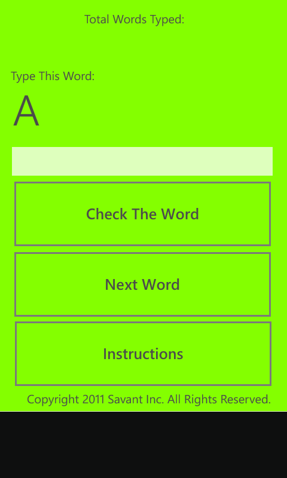
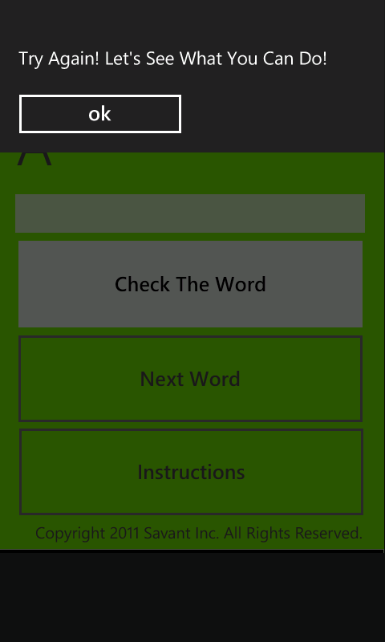

# TypeMe

A Windows Phone 7.1 educational spelling app designed for young children learning their first sight words.

## About

TypeMe helps young children practice typing and spelling common sight words. The app displays a word on screen, and the child types it in the text box. When they press "Check The Word", the app verifies their spelling and provides encouraging feedback.

## Features

- **39 Sight Words**: Includes common words like A, AND, AWAY, BIG, BLUE, CAN, COME, DOWN, FIND, GO, HELP, JUMP, LOOK, PLAY, RED, SEE, THE, UP, WE, WHERE, YELLOW, YOU, and more
- **Score Tracking**: Keeps count of correctly typed words
- **Encouraging Messages**: Milestone celebrations at 10, 20, 30, and 100 words in a row
- **Skip Function**: "Next Word" button allows skipping difficult words
- **Instructions Page**: Built-in help for new users

## Screenshots

| Main Screen | Gameplay |
|-------------|----------|
|  |  |

## Requirements

- Microsoft Visual Studio 2010 (or later with Windows Phone SDK)
- Windows Phone SDK 7.1
- Windows Phone 7.1 device or emulator

## Project Structure

```
TypeMe/
├── TypeMe.sln              # Visual Studio solution file
├── README.md               # This file
├── TypeMe/
│   ├── MainPage.xaml       # Main game UI
│   ├── MainPage.xaml.vb    # Main game logic
│   ├── instructions.xaml   # Instructions page UI
│   ├── instructions.xaml.vb# Instructions page logic
│   ├── App.xaml            # Application definition
│   ├── App.xaml.vb         # Application startup logic
│   └── My Project/         # Project settings
└── *.png, *.psd            # App store assets and screenshots
```

## How to Play

1. A word appears at the top of the screen
2. Type the word in the text box (use CAPITAL LETTERS)
3. Press "Check The Word" to verify your spelling
4. Get it right to earn points and see the next word
5. Use "Next Word" to skip if needed

## Building

1. Open `TypeMe.sln` in Visual Studio 2010+
2. Ensure Windows Phone SDK 7.1 is installed
3. Select the Windows Phone Emulator or a connected device
4. Press F5 to build and deploy

## License

This program is free software: you can redistribute it and/or modify it under the terms of the GNU General Public License as published by the Free Software Foundation, either version 3 of the License, or (at your option) any later version.

This program is distributed in the hope that it will be useful, but WITHOUT ANY WARRANTY; without even the implied warranty of MERCHANTABILITY or FITNESS FOR A PARTICULAR PURPOSE. See the [GNU General Public License](http://www.gnu.org/licenses/) for more details.

## Author

Jeremiah Isaacson - December 2011
